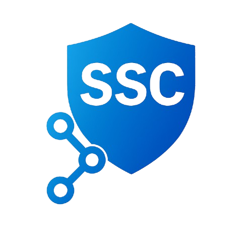

# 🔐 Secure Chain

**Secure Chain** is an open-source initiative dedicated to strengthening the security of the software supply chain (SSC). We provide tools to **analyze dependencies** and **communicate exploitability** through standard formats.

---

## 🚀 Projects

### [🔍 Depex](https://github.com/GermanMT/depex)

**Dependency Explorer (Depex)** builds full dependency graphs from manifest files like:

- `package.json` (npm)
- `requirements.txt` (pip)
- `pom.xml` (Maven)
- `Cargo.toml` (Rust)

These graphs include vulnerability data and are stored in **Neo4j** for rich querying and auditing.

➡️ [View on GitHub](https://github.com/GermanMT/depex)

---

### [🧾 VEXGen](https://github.com/GermanMT/vexgen)

**VEXGen** creates [VEX](https://www.cisa.gov/resources-tools/resources/vulnerability-exploitability-exchange-vex) documents to describe exploitability status of vulnerabilities in artifacts.

It integrates with:

- [OSV.dev](https://osv.dev/)
- SBOMs (CycloneDX / SPDX)
- Git history for tracking introduced/fixed commits

➡️ [View on GitHub](https://github.com/GermanMT/vexgen)

---

## 💡 Vision

Secure Chain exists to provide clear, trustworthy insights about the software components you rely on. Our goal is to empower developers, researchers, and enterprises with tools that scale and inform real-world SSC risk.

---

## 📬 Contact

📧 [securechaindev@protonmail.com](mailto:securechaindev@protonmail.com)  
🔗 [github.com/securechaindev](https://github.com/securechaindev)

---

© Secure Chain, {{ site.time | date: "%Y" }}
